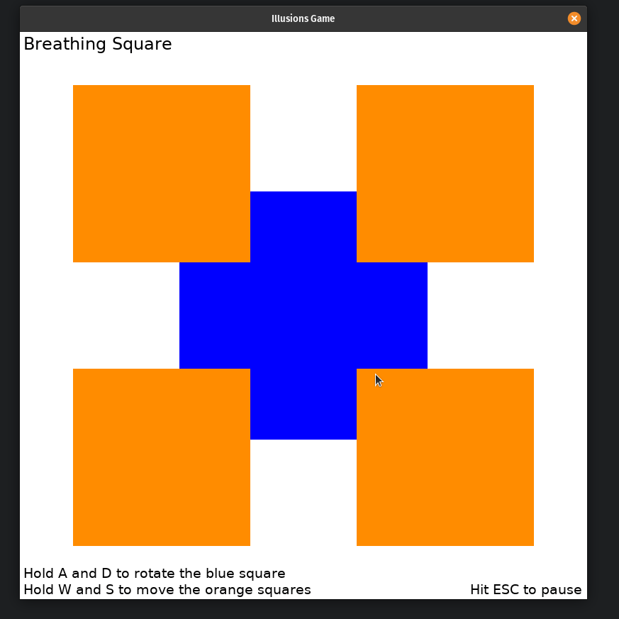
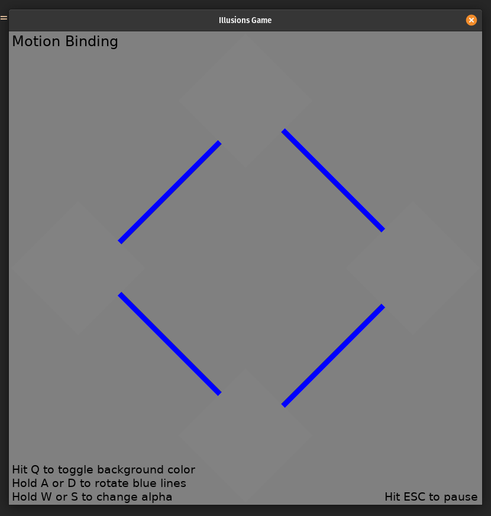
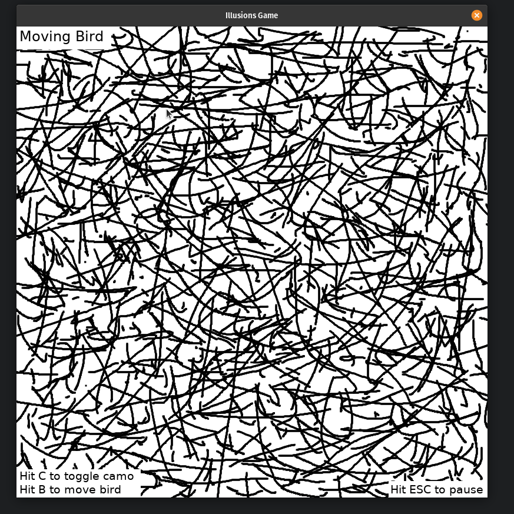
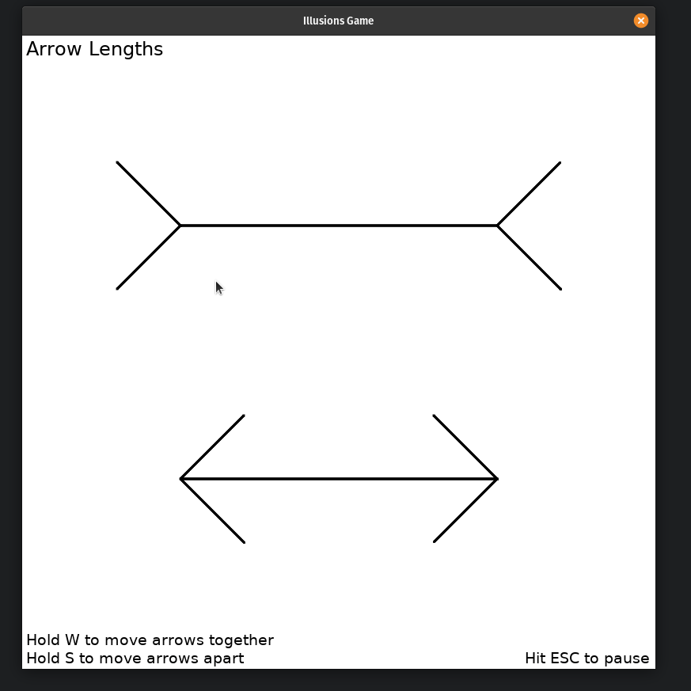

# game of illusions

small game that attempts to reproduce a set of classic visual illusions:

1. [x] breathing square
2. [x] motion binding
3. [x] hidden bird
4. [x] arrow lengths

illusions 1-3 by [michael bach, university of freiberg, germany](https://michaelbach.de/ot/).

illusion 4 is based on the [muller-lyer arrow illusion](https://en.wikipedia.org/wiki/M%C3%BCller-Lyer_illusion).

## breathing square

## motion binding

## hidden bird

## arrow lengths

## TODO
- [x] inherit screen dims from start.py
- [x] implement pause and reset with esc
- [x] implement exit game
- [ ] check variable assignment in classes
- [x] record gifs and add to readme
